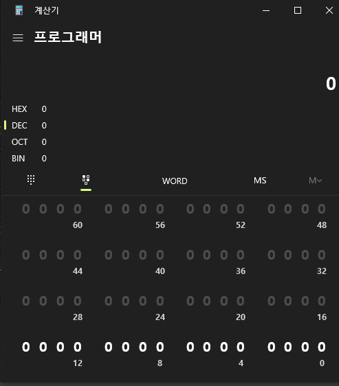
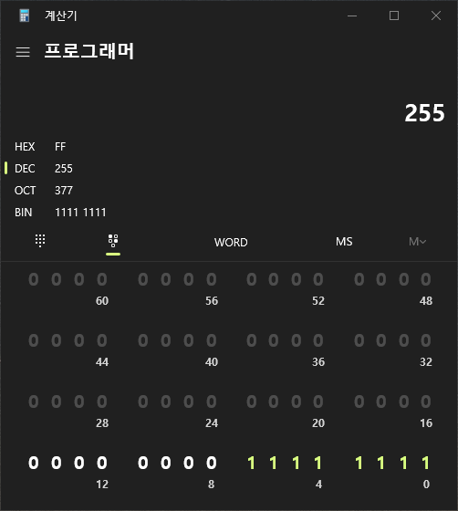
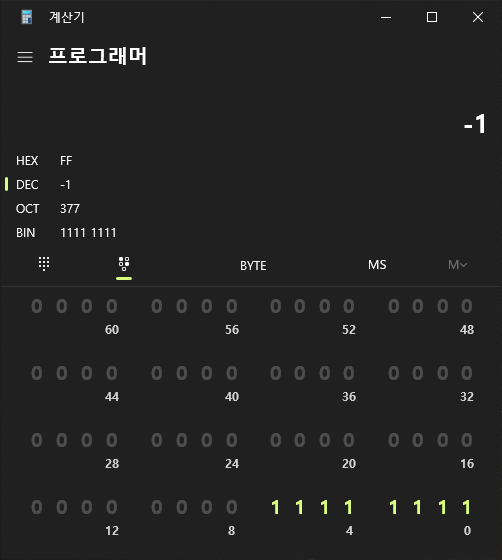
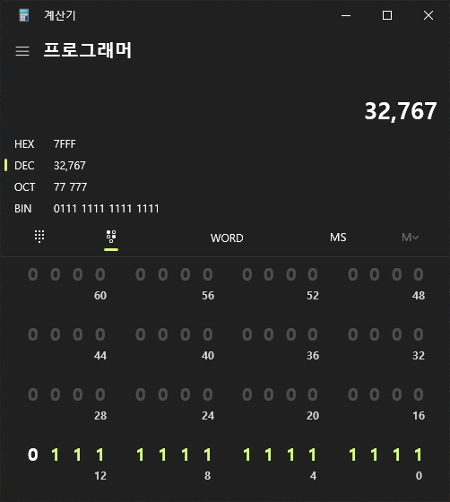
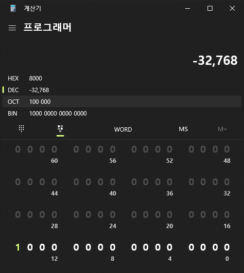

# Section 1-5 정수 범위의 비밀

> 정수 데이터 타입이 표현할 수 있는 정수의 범위는 각 데이터 타입의 바이트 크기에 따라 결정된다.

## 데이터 타입의 Byte 크기
|데이터 타입 이름| Byte 크기 | 정수 범위 |
|------|---|---|
|byte|1 바이트|0 ~ 255|
|short|2 바이트|-32,765 ~ 32,767|
|int|4 바이트 |-2,147,483,648 ~ 2,147,483,647|

- 정수형 데이터 타입 별 Byte크기가 서로 다르며 그에 따라 정수 범위도 다르다.
- 바이트는 1bit가 8개 모인 것을 의미하고 1bit는 0과 1를 표현할 수 있는 2진수의 한 자리 수를 의미한다.
- 즉, 1바이트는 2의 8승의 수만큼 표현이 가능하다는 것이 된다.

## 프로그래머 계산기를 활용한 정수 범위 알아보기
윈도우 기본 제공인 계산기의 프로그래머 모드를 사용하면 진법의 관계를 확인하기 용이하다.

위의 그림에서 우측의 8개 0를 클릭하여 1로 변경하게 되면  

의 모습이 된다. 이는 1바이트가 표현할 수 있는 최대 숫자를 의미한다.  
이는 1바이트가 양수만을 표현할 때의 값을 의미하고 만약 음수를 포함한 방식이라면  

위 사진과 같이 -1이 된다. 이는 부호를 사용하는 1바이트 표현식을 적용했기 때문인데,  
데이터 타입의 마지막 bit를 부호 비트로 사용할 경우 음수 표현이 가능하며 마지막 숫자가 -값을 가진채로 연산된다.  
즉, -128 + 64 + 32 + 16 + 8 + 4 + 2 + 1 = -1 이 되는 것이다.

---
부호를 사용하는 데이터 타입인 short를 계산해보면 

가장 큰 수인 32,767과  

가장 작은 수인 -32,768 사이의 값을 가지게 되는 것이다.
