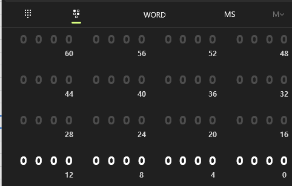

# Section 1-5 정수 범위의 비밀

> 정수 데이터 타입이 표현할 수 있는 정수의 범위는 각 데이터 타입의 바이트 크기에 따라 결정된다.

## 데이터 타입의 Byte 크기
|데이터 타입 이름| Byte 크기 | 정수 범위 |
|------|---|---|
|byte|1 바이트|0 ~ 255|
|short|2 바이트|-32,765 ~ 32,767|
|int|4 바이트 |-2,147,483,648 ~ 2,147,483,647|

- 정수형 데이터 타입 별 Byte크기가 서로 다르며 그에 따라 정수 범위도 다르다.
- 바이트는 1bit가 8개 모인 것을 의미하고 1bit는 0과 1를 표현할 수 있는 2진수의 한 자리 수를 의미한다.
- 즉, 1바이트는 2의 8승의 수만큼 표현이 가능하다는 것이 된다.

## 프로그래머 계산기를 활용한 정수 범위 알아보기

