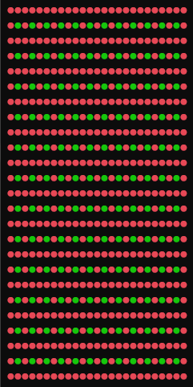

# Section 2-2 Binary Tree 미로 생성 알고리즘
## Binary Tree 미로


Binary Tree 미로는 사방이 막혀있는 타일 구조를 만든 이후 아래 또는 우측으로 랜덤하게 길을 뚫어가면서 미로를 만드는 로직으로 만들어진 미로를 말한다. 즉 아래 그림에서 초록색 좌표마다 아래 또는 오른쪽으로 막힌 길을 뚫어주는 방식으로 생성된다.



```csharp
public void InitBinaryTree(int size)
{
   _tile = new TileType[size, size];
   _size = size;

   for (int y = 0; y < size; y++)
   {
       for (int x = 0; x < size; x++)
       {
					 // 먼저 사방이 막혀있는 미로을 생성한다.
					 // 만들어진 미로를 아래 로직으로 하나씩 변경해주게 되면서 생성할것이다.
           if (x % 2 == 0 | y % 2 == 0)
           {
               _tile[y, x] = TileType.Wall;
               continue;
           }
           _tile[y, x] = TileType.Empty;
       }
   }

   for (int y = 1; y < size; y += 2)
   {
       for (int x = 1; x < size; x += 2)
       {
           if (x == size - 2 && y == size - 2)
               continue;

           if( x == size - 2)
           {
               _tile[y + 1, x] = TileType.Empty;
               continue;
           }
           if (y == size - 2)
           {
               _tile[y, x + 1] = TileType.Empty;
               continue;
           }

           int randValue = rand.Next(0, 2);
           if (randValue == 0)
               _tile[y + 1, x] = TileType.Empty;
           else
               _tile[y, x + 1] = TileType.Empty;
       }
   }
}
```