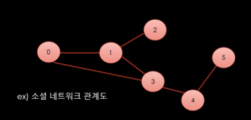
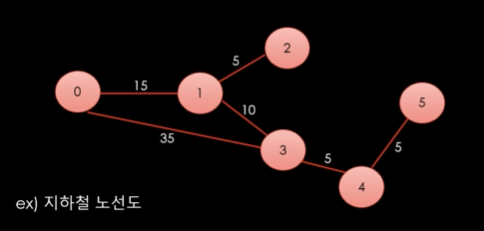
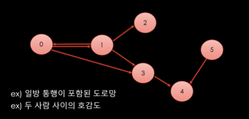
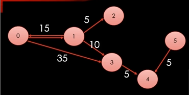

# Section 3-2 그래프 이론

## 그래프의 개념

현실 세계의 사물이나 추상적인 개념 간의 연결 관계를 표현한다.

- **정점(Vertext)** : 데이터 표현 (사물 또는 개념 등)
- **간선(Edge)** : 정점들을 연결하는데 사용



그래프의 개념은 단순하지만 이것으로 응용되는 범위가 넓기 때문에 굉장히 중요한 개념이다. 

각 간선에 가중치가 들어가 정점간의 거리가 있는 방식인 ‘`가중치 그래프`’도 존재한다.



간선에 방향의 개념이 들어가 있는 ‘`방향 그래프`’도 존재한다. 



그래프 구현에는 어떤 구조로 할지에 따라 다양한 방식으로 가능하지만 대표적으로 리스트 같은 타입을 이용하여 구현이 가능하다. 이러한 방식은 메모리를 아낄 수 있지만, 한번에 접근하는 것이 어려워 속도에서 손해를 본다. **간선이 적고 정점이 많은 경우에는 좋은 방식이다.**

```csharp
List<int>[] adj = new List<int>[6]
{
		new List<int> { 1, 3 },
		new List<int> { 0, 2, 3 },
		new List<int> { },
		new List<int> { 4 },
		new List<int> { },
		new List<int> { 4 }
};
```

각 리스트의 값들은 `간선`을 의미하고, 배열의 인덱스는 `정점`을 의미한다.

만약, 간선에 방향과 가중치가 포함되면 아래와 같이 표현할 수 있다. 



```csharp
class Edge
{
		public int _destVertax;
		public int _weight;
		public Edge(int destVertax, int weight)
		{
				_destVertax = destVertax;
				_weight = weight;
		}
}

static public List<Edge>[] adj2 = new List<Edge>[6]
{
		new List<Edge> { new Edge(1, 15), new Edge(3, 35) },
		new List<Edge> { new Edge(0, 15), new Edge(2, 5), new Edge(3, 10) },
		new List<Edge> { },
		new List<Edge> { new Edge(4, 5) },
		new List<Edge> { },
		new List<Edge> { new Edge(4, 5) },
};
```

리스트를 이용하는 방식은 메모리를 아끼는 대신 접근 속도가 상대적으로 느릴 수 있다. 각 정점에 대한 접근은 배열의 인덱스를 이용하기 때문에 빠르지만, 각 정점이 가지고 있는 간선에 대한 정보를 탐색하기 위해서는 **정점이 가지고 있는 리스트를 순차적으로 탐색해야하기 때문**이다. 그렇기 때문에 각 **정점이 가지고 있는 간선이 많아질수록 효율이 떨어진다.**

### 행렬을 이용한 그래프 표현

리스트 배열을 사용한 방법 말고도 행렬을 표현한 2차원 배열로 그래프를 자주 표현한다. 이 방식은 2차원 배열만을 이용하기 때문에 임의접근이 가능하지만 메모리 소모가 심하다. **이는 정점이 적고 간선이 많은 경우에 유리하다.**

```csharp
static public int[,] adj3 = new int[6, 6]
{
		{ 0, 1, 0, 1, 0, 0 },
		{ 1, 0, 1, 1, 0, 0 },
		{ 0, 0, 0, 0, 0, 0 },
		{ 0, 0, 0, 0, 1, 0 },
		{ 0, 0, 0, 0, 0, 0 },
		{ 0, 0, 0, 0, 1, 0 }
};
// 방향만을 표현하고 있다.
```

간선에 가중치가 있다면 해당 값으로의 위치에 가중치를 입력하고 안쓰는 숫자(예: -1)로 연결이 끊긴 것을 표현한다.

```csharp
static public int[,] adj4 = new int[6, 6]
{
	    { -1, 15, -1, 35, -1, -1 },
	    { 15, -1, 05, 10, -1, -1 },
	    { -1, -1, -1, -1, -1, -1 },
	    { -1, -1, -1, -1, 05, -1 },
	    { -1, -1, -1, -1, -1, -1 },
	    { -1, -1, -1, -1, 05, -1 }
};
// 방향과 가중치를 모두 표현하고 있다.
```