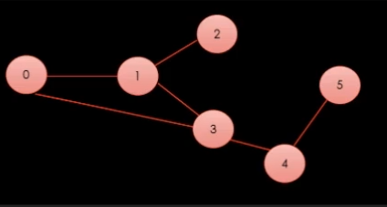

# Section 3-3 그래프 생성
## 그래프 순회 방식

그래프는 기준 정점을 선택하고 해당 정점을 시작으로 전체 그래프 정점에 대한 순회 방식을 크게 두가지로 나눌 수 있다. 

- **DFS (Depth First Search, 깊이 우선 탐색)**
- **BFS (Breadth First Search, 너비 우선 탐색)**

일반적으로 **DFS는 여러 방면에서 사용되는 편**이며, **BFS는 길찾기 알고리즘**에서 주로 사용된다.



실습을 위해 위 그래프를 리스트 배열로 표현하는 방식과 행렬을 이용하여 표현하는 방식으로 구현한다.

```csharp
static public List<int>[] adjacent1 = new List<int>[6]
{
		new List<int>() { 1, 3 },
    new List<int>() { 0, 2, 3 },
    new List<int>() { 1 },
    new List<int>() { 0, 1, 4 },
    new List<int>() { 3, 5 },
    new List<int>() { 4 }
};
```

```csharp
static public int[,] adjacent2 = new int[6,6]
{
		{ 0, 1, 0, 1, 0, 0 },
    { 1, 0, 1, 1, 0, 0 },
    { 0, 1, 0, 0, 0, 0 },
    { 1, 1, 0, 1, 0, 0 },
    { 0, 0, 0, 1, 0, 1 },
    { 0, 0, 0, 0, 1, 0 }
};
```