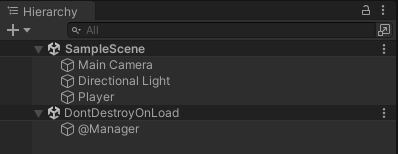

# Section 1-5 Singleton 패턴
## 전역 매니저 사용하기

이전 시간에  생성한 전역 매니저 역할을 하는 @Managers 오브젝트의 Manager 클래스를 인스턴스화 하여 사용하는 방법에는 첫 번째로 다음과 같은 방법이 있다.

```csharp
public class Player : MonoBehaviour
{
    void Start()
    {
        GameObject manager = GameObject.Find("@Manager");
        Manager ma = manager.GetComponent<Manager>();
    }
    void Update()
    {
        
    }
}
```

먼저 같은 Scene에 있는 오브젝트를 찾아내어 반환해주는 `GameObject.Find` 메소드를 통해 오브젝트를 찾아내고, 오브젝트 내에 있는 컴포넌트를 `GetComponent` 메소드로 반환한다. 

위와 같이 특정 이름으로 오브젝트를 찾아 반환하는 방식은 부하가 많이 발생하는 방식으로 가능하면 피해주는 것이 좋다. 

하나의 프로젝트에서 매니저 인스턴스는 하나만 생성되어 관리되는 것이 당연하다. 

💡 **유니티에서의 클래스 인스턴스**

일반적으로 클래스는 선언만 하고 사용하는 영역에서 인스턴스화하여 사용된다. 그렇지만 유니티에서는 따로 클래스를 인스턴스화하여 사용하지 않는다. C# 스크립트가 컴포넌트화되어 오브젝트에서 실행될 때, **유니티 엔진에 의해 자동으로 인스턴스화가 진행되기 때문이다.** 만약, **매니저 스크립트를 공유하고 있는 여러 개의 매니저 오브젝트가 있다면 여러개의 매니저 인스턴스가 생성되는 것과 같다.** 

매니저 오브젝트를 여러개를 사용하는 경우는 없겠지만 혹시라도 그러한 상황이 생기는 것을 방지하기 위해 매니저 클래스의 인스턴스는 딱 한번만 생성되어 공유하는 소프트웨어 디자인 패턴인 **Singleton 패턴**을 사용하여 만드는 것이 일반적이다.


Singleton 으로 매니저 클래스를 구현하는 방법은 아래 과정을 따른다.

```csharp
public class Manager : MonoBehaviour
{
    static Manager _instance; //유일성을 보장한다.
		public static Manager GetInstance() { return _instance; }

		void Start()
		{
				_instance = this;
		}
}
```

`**static 키워드**`로 작성한 변수와 메소드는 유일성이 인스턴스화되지 않고 유일성이 보장된다는 점을 이용하여 `Singleton` 구현에 활용된다. 유니티 엔진에 의해 자동 인스턴스화가 진행될 것이므로 따로 **`new 연산자`**를 사용하지 않고 프로젝트가 실행될 때 인스턴스를 `this 키워드`를 통해 **자기 자신을 지정해주면 된다.**

하지만 여러 게임 오브젝트에서 매니저 스크립트를 가지고 있을 경우(사실 이런 경우 자체가 문제이긴하다) 정적 _instance 변수의 값이 Start 메소드에 의해 변경된다. 

위와 같은 문제 해결을 위해 Start 부분에 오브젝트 이름을 지정하여 하나의 인스턴스만을 공유하도록 변경한다.

```csharp
void Start()
{
    GameObject manager = GameObject.Find("@Manager");
    Manager _instance = manager.GetComponent<Manager>();
}
```

즉, ‘@Manager’ 이름을 가지고 있는 오브젝트의 Manager 인스턴스만을 매니저로 사용하겠다는 것을 의미한다. 

위 코드는 정상적으로 작동하기는 하지만 ‘@Manager’ 오브젝트가 없을 경우에는 원하는대로 작동하지 않게 된다. 그러한 상황을 대비하여 만약 타겟으로 하는 오브젝트가 없을 때 해당 오브젝트를 생성하는 코드까지 추가한다.

```csharp
public class Manager : MonoBehaviour
{
    static Manager _instance ; //유일성을 보장한다.
		public static Manager GetInstance() { init(); return _instance; }

    void Start()
    {
        init();
    }
    static void init()
    {
        if (_instance == null)
        {
						GameObject manager = GameObject.Find("@Manager");
		        if (manager == null)
		        {
		            manager = new GameObject { name = "@Manager" };
		            manager.AddComponent<Manager>();
						}
	          DontDestroyOnLoad(manager);
						_instance = manager.GetComponent<Manager>();
				}
	  }
}
```

매니저를 사용하기 위해 GetInstance를 호출하는 곳에서는 다음과 같은 로직이 수행된다.

1. 매니저의 `init 함수`가 실행된다. 
2. `@Manager` 이름의 게임 오브젝트가 있다면 해당 오브젝트의 `Manager 컴포넌트`를 `_instance 변수`에 입력한 후 해당 인스턴스를 습득한다.
3. `@Manager` 이름의 게임 오브젝트가 없다면 해당 이름의 오브젝트 생성 후, `Manager 컴포넌트`를 생성된 오브젝트에 끼워넣은 후 `_instance 변수값`을 업데이트하고 해당 값을 습득한다.

DontDestroyOnLoad 메소드는 해당 게임 오브젝트의 옵션을 설정하는 부분이다. 해당 옵션을 가지게된 게임 오브젝트는 씬이 변경되거나 하는 상황에서도 삭제되지 않게 된다. **즉, 전역 함수처럼 지역에 따라 삭제되지 않게 된다는 것이다.**



사용하고자 하는 곳에서는 아래와 같이 사용해주면 된다.

```csharp
public class Player : MonoBehaviour
{
    void Start()
    {
        Manager manager = Manager.GetInstance();
		}
}
```

<aside>
💡 **Property 활용하기**

매니저 인스턴스를 활용하는 방법은 해당 인스턴스에 접근한 후 개별 기능을 담당하는 또 다른 매니저에 접근하는 것이다. 즉, `Manager.GetInstance().InputManager.Function()` 과 같은 형태로 사용된다. 그렇기 떄문에 인스턴스를 얻는 방식을 메소드가 아닌 `Property`를 사용하면 사용함에 있어 간편함의 이점을 얻을 수 있다.

```csharp
static Manager s_instance; //유일성을 보장한다.
public static Manager Instance { get { init(); return s_instance; } }
```

**s_ 표기 이유는 static를 뜻하고, Property는 대문자로 기입하여 구분짓는다.**

`set` 기능은 사용하면 안되므로 `자동 Property` 기능없이 사용해야 해야하므로 변수를 따로 생성해주고 있다.

```csharp
public class Player : MonoBehaviour
{
    void Start()
    {
        Manager manager = Manager.Instance;
		}
}
```

위와 같이 매우 멤버변수에 접근하는 것과 같이 사용할 수 있다.

</aside>