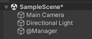
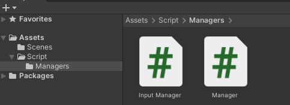

# Section 3-4 매니저 만들기
## 매니저 만들기

게임 개발 프로젝트를 수행하다보면 각 컴포넌트에 적용될 C# Script와 게임 전역으로 적용될 C# Script가 따로 작성되어 관리된다. 특히 프로젝트 규모가 커질수록 어디서든 불러와 사용되어야할 전역 기능들이 많아지게 되고 관리가 중요해진다. 

네트워크 통신, 키보드 입력, 마우스 입력 등의 작업은 여러 컴포넌트에서 관리되기보단 전역 관리 매니저 클래스를 만들어 관리하는 것이 유지보수와 효율성이 좋다. 

Manager 클래스 작성을 위해 Create→C# Script 메뉴로 새로운 스크립트를 생성한다. 기본적으로 유니티 C# 스크립트는 `MonoBehaviour 클래스`를 상속받는다.

```csharp
public class Manager : MonoBehaviour{...}
```

매니저 클래스를 사용하기 위해서는 인스턴스로 생성해줘야 하므로 다른 스크립트에 new 키워드로 인스턴스를 생성하는 코드를 작성한다.

```csharp
public class TestScript : MonoBehaviour
{
    void Start()
    {
        Manager manager = new Manager();
    }
}
```

위 코드를 실행하면 유니티에서 경고 메시지를 출력한다. 해당 경고 메시지는 `MonoBehaviour 클래스`를 new 키워드로 인스턴스 생성하는 것에 대한 경고 메시지이다.


💡 **MonoBehaviour 클래스**

해당 클래스의 구현부를 찾아 들어가게 되면 또 다른 부모 클래스들을 확인할 수 있으며 최종적으로 가장 윗단에 있는 클래스는 `Object 클래스`이다. 이는 C#의 모든 **컴포넌트들의 부모클래스**로 해당 클래스가 있어야만 여러 유니티 요소에 붙이거나 떼는 작업을 할 수 있게 되는것이다.


매니저 클래스는 어떤 오브젝트의 부품으로 사용될 목적이 아닌 전역으로 사용되는 클래스이므로 MonoBehavior 클래스를 상속받으면 안된다.

```csharp
public class Manager
{
    void Start() { }
    void Update() { }
}
```

본래 `Start` 와 `Update` 함수는 유니티가 동작하는 상황에서 첫 시작에 실행되는 부분과 반복적으로 실행되는 부분을 정의할 수 있는 함수였다. 하지만 전역 클래스로의 사용을 위해 `MonoBehavior 클래스`의 상속을 지워버리게 되면 일반적인 C# 클래스가 되어 해당 함수들은 그 역할을 수행하지 못한다. 일반적인 C# 스크립트는 Main이라는 프로그램 진입점이 존재하는데 반해 유니티는 숨겨져 있어 직접적인 수정이 불가능하다. 때문에 결국 매니저 클래스도 `MonoBehavior 클래스`를 상속받은 상태에서 **특정 오브젝트의 컴포넌트로 작동해야 한다는 말**이 된다.



위와 같이 Manager 오브젝트를 생성하고 매니저 스크립트를 컴포넌트로 붙여 사용하면 된다. **(@를 이름 앞에 붙여준 이유는 단순하게 전역으로 동작하고 있고 중요한 파일을 나타내는 표시이며 특별한 기능은 없다)**

💡 **Manager 오브젝트**

결국에는 유니티 오브젝트를 만들고 MonoBehavior도 상속받음으로써 다른 컴포넌트와 동일한 설정으로 동작하게 되었다. 다른 점이라고 한다면 매니저 오브젝트는 다른 오브젝트처럼 UI를 입혀 사용자의 눈에 보이는 것이 아닌 추상 오브젝트로써 전역 기능만을 수행하도록 구현할 것이다. 

매니저 오브젝트에는 앞으로 다양한 기능(**네트워크, 키보드 I/O, 오브젝트 동적 생성 등**)을 관리하게 될 것이고 각 기능은 각기 다른 스크립트 파일로 관리된다. 이러한 파일들을 하나의 폴더로 묶어 관리하기 좋으므로 기존 `Script 폴더` 내부에 `Managers 폴더`를 생성하여 매니저 관련 스크립트들을 관리한다.

