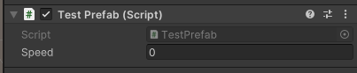
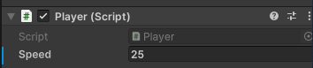
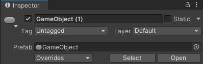
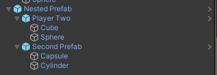
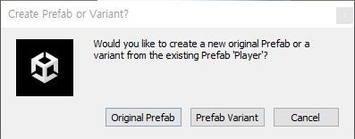

# Section 3-2 Prefab #2
## Prefab Override

C# 스크립트도 당연하게 `Prefab`에 등록할 수 있다. `Prefab`에 등록된 스크립트가 변하면 이미 생성되어 있는 인스턴스들에도 영향을 미친다. 

`[SerializeField]`로 필드를 정해주면 **해당 값은 유니티 엔진에서 UI로 값을 지정할 수 있게 된다.** 

```csharp
public class TestPrefab : MonoBehaviour
{
    [SerializeField]
    int speed;
}
```



여기서 `Speed`의 값을 변경해주면 이미 생성되어져 있는 `Prefab 인스턴스`들에도 영향이 준다. 

**단, 개별적으로 override된 인스턴스의 경우에는 변화가 적용되지 않는다.**

💡 **인스턴스 개별 Override**

Prefab 인스턴스를 개별적으로 값을 변경하면 아래와 같이 해당 부분이 굵게 표시된다. 굵게 표시된 부분은 이후 Prefab 자체가 변경되더라도 해당 부분은 영향을 받지 않게 된다.





각 인스턴스에 변경점을 준 다음에 `Overrides 버튼`을 클릭하여 기존 **Prefab에 덮어쓰기**로 내용을 변경해줄수도 있으며, Prefab을 더블클릭하여 수정하기도 한다.

스크립트뿐 아니라 각 게임 오브젝트 요소들의 크기의 변경, 위치의 변경, 속성의 변경 등도 `Override`된다. 

### Nested Prefab : 중첩된 프리펩

여러 `Prefab`를 하나의 `Prefab`으로 묶어서 또 다른 `Prefab`를 만드는 것을 말한다. 클래스를 예로 들면 **하나의 클래스 내부에 여러 또 다른 클래스의 인스턴스를 생성하여 사용하는 것과 비슷하다.**



클래스처럼 각 하위 **`Prefab`**들도 각자의 틀을 가지고 있기 때문에 해당 클을 변경해주면 그래도 적용된다. **Override 규칙은 그대로 적용된다.**

### Prefab Variant : 프리펩 상속

**클래스의 상속과 같은 개념**이다. 어떤 `Prefab`을 상속받아 부모 `Prefab`의 모든 값을 가져오기는 하지만 개별적인 다른 속성이나 기능을 추가할 때 사용된다. 

`Hierarchy` 창의 `Prefab 인스턴스`를 기존의 `Prefab`이 있는 `Project 폴더`로 끌어내린다. 



이후 `Prefab Variant 버튼`을 클릭하게 되면 상속을 받게된 `Prefab`이 생성된다. 부모 `Prefab`의 변경사항을 따라가기는 하지만 개별적인 변경점과 추가 오브젝트들을 구성할 수 있다.