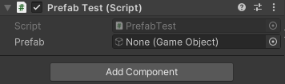
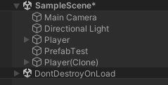

# Section 3-3 Resource Manager
## 게임 오브젝트 동적 생성

`Object.Instantiate` 또는 `Instantiate` 메소드를 통하여 현재 Scene에 오브젝트를 생성할 수 있다. 메소드는 여러가지 오버로딩된 버전이 있지만 가장 많이 사용되는 것은 입력으로 받은 오브젝트를 생성하는 버젼이다.

```csharp
public class PrefabTest : MonoBehaviour
{
    public GameObject prefab;
    void Start()
    {
        Object.Instantiate(prefab);
    }

}
```

위와 같은 스크립트를 가진 게임 오브젝트는 또 다른 오브젝트를 포함시킬 수 있는 공간이 생기고 해당 공간에 원하는 Prefab를 넣어주게 되면 Prefab 인스턴스가 생성되게 된다.



Prefab 속성의 오브젝트 Player Prefab를 넣어주어 유니티를 실행시키면 아래와 같이 동적으로 오브젝트 생성되게 된다. Game Object는 유니티에서 사용되는 모든 구성요소를 넣을 수 있으므로 스크립트를 넣어줄 수도 다른 컴포넌트를 넣어줄 수도 있다. 즉, 모든 요소를 동적으로 생성할 수 있다는 게 된다.



오브젝트에 대한 삭제도 간단하다. 위의 예제에서 Instantiate의 반환값은 GameObject로, 생성에 성공한 오브젝트를 반환해준다. 이를 이용하여 일정시간이 경과한 후 생성한 Prefab를 삭제하는 코드는 다음과 같다.

```csharp
public GameObject prefab;

GameObject player;
void Start()
{
	  player = Object.Instantiate(prefab);
	
	  Destroy(player, 3.0f);
}
```

이러한 방식은 규모가 작거나 인디게임 개발에서는 사용이 가능할지 모르나 규모가 커지게 되면 사용하기 어려워진다. 심지어 오브젝트나 Prefab를 기획자들이 데이터파일로 따로 관리하는 경우에는 위의 방식으로 사용하기는 더욱 어려워진다. 때문에 코드로 특정 오브젝트에 접근하여 불러오는 방법이 필요하다.

```csharp
GameObject prefab;
GameObject player;

void Start()
{
    prefab = Resources.Load<GameObject>("Prefab/Player");
    player = Object.Instantiate(prefab);
}
```

`Resources.Load 메소드`는 경로를 입력하여 해당 위치의 게임 오브젝트를 반환해주는 기능을 제공한다. 기준이 되는 경로는 `Assets→Resources 폴더`이다. 이를 위해 `Resources 폴더`를 생성해주고 게임 오브젝트로 불러와 사용하고자 하는 **Prefab이나 Art, Sound 등을 위치시켜야 한다.**

흩어져 있는 여러 스크립트에서 오브젝트를 개별적으로 생성하고 삭제한다면 관리하기가 굉장히 어려워진다. 이러한 기능은 `전역 Manager`에 등록하여 **모든 오브젝트의 동적 생성/삭제 관리를 맡기면 편리하다.**

Input Manager의 경우 키보드 입력을 감지하여 발생하는 기능이므로 이벤트 기반의 로직을 구성했지만 Resource Manager 같은 경우는 사용자가 호출하는 경우에만 사용되어야 하므로 일반적인 클래스처럼 작성한다. 단, 게임 오브젝트 생성하는 기능들은 Resources에 이미 구현되어 있으므로 해당 기능들을 래핑하는 메소드들로 작성해주어야 한다.

**Load**

```csharp
public class ResourceManager
{
		public T Load<T>(string path) where T : Object
		{
			return Resources.Load<T>(path);
		}
}
```

**Instantiate**

```csharp
public GameObject Instantiate(string path)
{
		GameObject prefab = Resources.Load<GameObject>($"prefab/{path}");
		if ( prefab == null)
		{
			Debug.Log("$Failed to load prefab : {path}");
			return null;
		}
		return Object.Instantiate(prefab); 
}
```

**Destroy**

```csharp
public void Destroy(GameObject obj)
{
		if (obj != null)
		{
			Destroy(obj);
		}
}
```

매니저 기능을 사용하려면 Manager에 ResourceManager 인스턴스를 넣어두고 해당 인스턴스에 접근하여 사용한다.

```csharp
public class Manager : MonoBehaviour
{
    static Manager s_instance; //유일성을 보장한다.
    static Manager Instance { get { init(); return s_instance; } }

    static InputManager _inputManager = new InputManager();
    public static InputManager Input {get { init(); return _inputManager; }} 

    static ResourceManager _resource = new ResourceManager();
    public static ResourceManager Resource { get { init(); return _resource; } }
}
```

```csharp
public class PrefabTest : MonoBehaviour
{
		void Start()
		{
				GameObject go = Manager.Resource.Instantiate("Player");
				Debug.Log("Test Manager");
		}
}
```

### 직접 만들어본 Resource 매니저

`ResourceManager 클래스`

```csharp
public class ResourceManager
{
	GameObject _go = null;
	string _path = string.Empty;
	public string Path { set { _path = value; } }
	public void CreateObject()
	{
		if(_path != string.Empty)
		{
			_go = Resources.Load<GameObject>(_path);
			Object.Instantiate(_go);
			_path = string.Empty;
		}
		return;
	}
}
```

`Manager : MonoBehaviour 클래스`

```csharp
static ResourceManager _resource = new ResourceManager();
public static ResourceManager Resource { get { init(); return _resource; } }

void Update()
{
    _inputManager.Onupdate();
    _resource.CreateObject();
}
```
