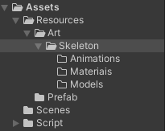
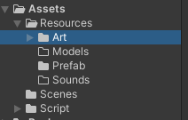

# Section 3-4 폴더정리
## 폴더 정리 요령

Resources 폴더가 여러 리소스를 코드상으로 로드할 때 기준이 되므로 해당 폴더 아래로 일련의 규칙을 가지고 정리를 해두어야 작업이 있어서 용이하다. 

프로젝트나 개인의 성향에 따라 폴더의 정리 방법이 다르긴하지만 컴포넌트 종류에 따라 분리하여 관리하기도 하고 하나의 게임 오브젝트 별로 분리하여 관리하기도 한다.

**Skeleton** 게임 오브젝트와 관련된 모든 리소스들을 하나의 폴더로 관리하기도 하는 방법과

용도에 따라 분리하여 관리하는 방법 등이 있다.