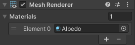
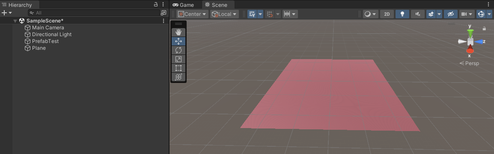
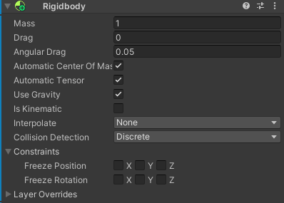
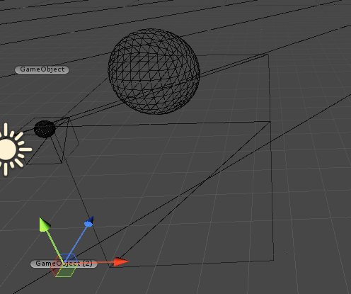

# Section 4-1 Collider
## Collider

게임 오브젝트와 게임 오브젝트가 서로 닿았을 때를 **충돌**이 발생했다고 한다. 이러한 충돌을 감지하는 구성 요소로 `Collider`가 있으며 종류가 꽤나 다양하게 있다. 

**Collider 종류**

1. **Box Collider**: 직육면체 모양의 충돌 영역을 나타낸다. 
2. **Sphere Collider**: 구 형태의 충돌 영역을 나타낸다. 
3. **Capsule Collider**: 원통 모양의 충돌 영역을 나타낸다. 주로 캐릭터 컨트롤러와 같이 캐릭터 형태의 게임 오브젝트에 사용된다.
4. **Mesh Collider**: 복잡한 3D 모델의 형태를 정확하게 표현하기 위해 사용된다. 게임 오브젝트의 메시를 기반으로 충돌 영역을 만들 수 있지만, 성능에 부하가 걸리는 편이라 주의해야 한다.
5. **Terrain Collider**: Unity의 지형 시스템을 사용하는 경우 지형에 대한 충돌 영역을 제공한다.
6. **Wheel Collider**: 자동차 및 차량 관련 게임 오브젝트에서 바퀴의 동작을 시뮬레이션하는 데 사용된다.

실습을 진행하기 위해 바닥에 해당하는 오브젝트를 생성해야 한다. 3D 오브젝트 중 `Terrain` 또는 `Plane`으로 만들 수 있으며 간편하게 사용할 수 있는 `Plane`으로 생성한다.

색상을 입히기 위해 `Resources` 폴더 내부에 `Material 오브젝트`를 하나 생성하고 `Plane`에 입혀준다. **드래그 앤 드롭** 또는 `Mesh Renderer 컴포넌트` 속성인 `Materials`에서 직접 선택해준다.

아래와 같은 상태가 되면 올바르게 생성한 것이다. (색상은 다를수 있다)

이제 땅 위에서 이동하는 게임 오브젝트를 가져와야 하며, 이전에 만든 `Prefab`를 써도 괜찮고 새로운 오브젝트를 만들어서 사용해도 괜찮다. 단, 이동 관련 스크립트는 포함시켜 놓아야 한다.

다음으로 해야할 작업은 게임 오브젝트에 유니티 물리 엔진을 적용시켜야 한다. 이를 위한 컴포넌트가 별도로 있으며 `Rigidbody`와 `Rigidbody 2D`가 있다. 

`Rigidbody`에 있는 여러 옵션 중 가장 많이 사용되는 옵션에는 `Mass`, `Use Gravity`, `Is Kinematic`, `Constraints`가 있다. 

- **Mass, 질량** : 물체가 다른 물체에 어떤 영향을 미치는지 결정하는 중요한 요소 중 하나이다. 더 높은 질량을 가진 물체는 더 큰 힘을 필요로 하며, 다른 물체에 더 큰 영향을 미칠 수 있다. 단위는 kg으로 사용된다.
- **Use Gravity, 중력 사용** : 해당 옵션을 사용할 경우, 물체는 전역 중력 설정에 따라 아래로 떨어질 것이며 가속도를 받게 된다.
- **Is Kinematic, 키네마틱** : 해당 옵션을 키게 되면 물리 엔진의 영향을 받지 않게 된다. 이는 개발자가 직접 위치 조절과 회전, 애니메이션과 같은 컴포넌트에서 조작하기 위한 옵션이다.
- **Constraints, 제약 조건** : `Rigidbody`의 움직임을 제한하는데 사용된다.

`Use Gravity`를 키더라도 `Collider 컴포넌트`가 없다면 원하는 동작(바닥 오브젝트 위에 서거나 물체에 가로막히는 것)을 하지 못한다. 

Collider의 여러 종류들은 어떤 형태로 취급할것인지를 결정하는 것이 다르고 기능들은 비슷하므로 적절한 것을 선택하면 된다. `Edit Collider 버튼`을 클릭하면 크기를 변경할 수 있다.

충돌을 Collider를 사용하여 연산을 하는 이유는 성능적인 이점때문이다. 일반적으로 게임 캐릭터나 몬스터 같은 오브젝트는 무수한 삼각형의 와이어들로 이루어져 있다. 충돌에 이러한 와이어들을 이용하면 정확도는 높아지지만 연산량이 많아져 성능에 문제를 일이킬 수 있다. 그렇기 때문에 굉장히 정교한 충돌이 필요한 게임이나 오브젝트가 아니라면 `Collider 컴포넌트`로 어느정도 타협을 보는 것이 좋다.

Collider는 충돌하는 두 오브젝트에서 모두 가지고 있어야만 충돌이 발생한다.