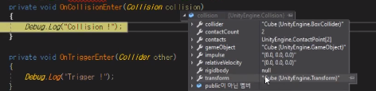
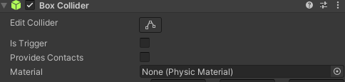

# Section 4-3 Trigger

## Collision 객체

이전 시간에 배운 충돌 이벤트 중 Collision이 발생하면 충돌한 대상의 정보를 가지고 있는 Collision 객체가 입력으로 들어온다.


해당 객체는 다음과 같은 정보를 포함한다.

1. **collider** : 충돌이 발생한 `Collider`를 나타낸다. 이것은 충돌한 다른 물체의 `Collider`에 대한 참조이다. 예를 들어, 충돌한 물체가 어떤 종류의 `Collider`를 가지고 있는지를 알 수 있다.
2. **gameObject** : 충돌이 발생한 게임 오브젝트를 나타낸다. 이것은 충돌한 물체를 포함하고 있는 게임 오브젝트에 대한 참조이다. 충돌한 물체가 어떤 게임 오브젝트에 속하는지를 확인할 수 있다.
3. **contacts** : 충돌 지점에 대한 정보를 제공하는 `ContactPoint` 배열이다. `ContactPoint`는 충돌한 지점의 위치, 표면 노멀(법선 벡터), 상대 속도 등의 정보를 포함한다. 이 배열을 통해 충돌 지점에서 추가적인 계산이 가능하다.
4. **relativeVelocity** : 충돌 지점에서의 상대적인 속도를 나타냅니다. 이것은 충돌 중인 물체 간의 상대적인 속도 벡터를 제공합니다. 이 정보는 충돌 반응을 조절하는 데 사용될 수 있습니다.

```csharp
private void OnCollisionEnter(Collision collision)
{
    Debug.Log(collision.gameObject.name);
}
```

위 코드와 같이 작성하여 실행시키면 Collision이 발생할 때 충돌한 상대방의 게임 오브젝트 이름 값을 콘솔에 출력한다.

## Trigger


물리 엔진이 적용되는 Collision 이벤트에 의한 처리는 물리와 관련된 연산이 발생한다.



`Box Collider`의 속성에 있는 `Material` 옵션은 색상과 질감 등을 말하는 것이 아니라 물리 엔진의 작동 방식에 대한 내용이다. 즉, 충돌이 발생했을 때 마찰력, 관성, 중력 등이 어떤 식으로 연산되어 작동하는지를 나타낸다. 이러한 연산은 굉장히 큰 부하를 일으키므로 **RPG와 같은 게임에서 사용하기에는 무리가 있다.** 이러한 상황에서 충돌과 유사하지만 물리 엔진의 적용을 없애고 단지 충돌 이벤트만을 처리하고자 할 때 `Is Trigger 옵션`을 사용한다. **해당 옵션은 나와 상대 중에 한 오브젝트만 켜져 있어도 충돌 이벤트가 Trigger로 발생하게 된다.**

`Trigger` 객체도 `Collision`객체와 유사한 정보를 가지고 온다.

```csharp
private void OnTriggerEnter(Collider other)
{
    Debug.Log(other.gameObject.name);
}
```

Collision과 Trigger이벤트 발생에 따라 호출되어 사용되는 `OnCollisionEnter`, `OnTriggerEnter`는 모두 콜백함수 방식이다.