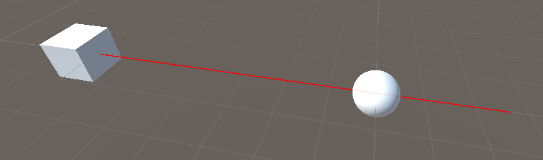

# Section 4-4 Raycasing #1
## Raycasting

3D 공간에서 Ray(광선)을 발사하고 그 광선이 충돌하는 지점을 검출하는 기술로, 카메라 동작, 충돌 감지, 게임 오브젝트 검출과 같은 기능을 구현할 때 자주 사용된다. 유니티 엔진의 Scene에서 2D화면인 모니터에서 3D 공간의 오브젝트를 클릭할 수 있는 이유도 이 Raycasting 기술이 들어가 있기 때문이다. 

게임 오브젝트를 Ray를 통해 감지하기 위해서는 해당 오브젝트가 충돌 영역이 설정되어 있어야만 한다. 즉, Collider 컴포넌트가 있어야 한다는 의미이다.

기본적으로 `Raycasting`은 `Physics.Raycast 메소드`를 통해 사용할 수 있다.

```csharp
Physics.Raycast(transform.position, Vector3.forward);
// bool 타입의 반환 형식을 가지고 있다.
// Physics.Raycast(transform.position, Vector3.forward , 10.0f); 는 MaxDistance 지정

Debug.DrawRay(transform.position, Vector3.forward * 10, Color.red);
// 실제 광선을 확인하는 위해 디버그를 이용한다. 
```

다양한 오버로딩 버젼이 있다. 위 코드는 광선의 시작점과 방향을 설정해주는 방식으로 구현하고 있는 것이다. 즉, 현재 게임 오브젝트의 기준점에서 앞 쪽으로 광선을 발사하고 충돌하는 오브젝트가 있다면 True를 반환하고 그렇지 않으면 False를 반환한다. 

```csharp
if (Physics.Raycast(transform.position, Vector3.forward))
{
		// 어떤 오브젝트가 레이에 감지되었을 때 처리되는 로직
}
```

위와 같이 일반적으로 사용되긴 하나, 이 방법은 충돌한 오브젝트의 정보를 가져올 수 없고 단순히 충돌 여부에 따른 동작을 구현하는데에 지나지 않는다. 충돌한 오브젝트에 대한 정보를 얻기 위해서는 오버로드된 다른 저변의 Raycast 메소드를 사용해야 한다. 

```csharp
RaycastHit hit;
Physics.Raycast(transform.position, Vector3.forward, out hit, 10.0f);
```

이렇게 하면 RaycastHis 타입의 hit 인스턴스에 충돌한 오브젝트의 정보가 들어오게 된다. 해당 객체는 다른 충돌 클래스 인스턴스들과 유사한 정보를 포함하고 있다. 어렵지 않으니 실전에서 사용하면서 알아봐도 괜찮다.

위의 코드에서 `Vector3.forword` 같은 경우에는 **절대 좌표계를 기준으로 삼기 때문**에 게임 오브젝트이 방향이 달라지더라도 레이의 방향은 달라지 않는다. 이를 개선하기 위해 아래와 같은 코드를 작성한다.

```csharp
Vector3 look = transform.TransformDirection(Vector3.forward);

RaycastHit hit;
if (Physics.Raycast(transform.position, transform.TransformDirection(Vector3.forward), out hit, 10.0f))
{
		Debug.Log(hit.collider.gameObject.name);
}
```

해당 코드는 월드 좌표, 로컬 좌표에 대한 개념이다. transform.TransformDirection 메소드는 로컬 방향 벡터를 입력받아 현재 오브젝트를 기준으로 입력받은 로컬 방향 벡터에 알맞는 절대 공간 좌표로 반환해준다. Vector3.forword의 좌표는 (0, 0, 1)로 Z축 방향을 의미한다. 결과적으로 해당 오브젝트의 Z축 앞 방향에 해당하는 절대좌표를 얻게 되는것이다.

디버그로 레이를 확인하게 되면 오브젝트를 관통하듯 사용된다. 하지만 실제 Raycast에서 발사되는 광선은 충돌을 관통하지 못한다. 그렇기 때문에 오브젝트가 나란히 있더라도 가장 첫 번째 충돌이 발생한 오브젝트의 정보만을 hit 객체에 담는다. 만약 여러 오브젝트를 관통하는 레이와 충돌 오브젝트의 정보를 얻고자 한다면 RaycastAll 메소드를 사용해야 한다.



```csharp
RaycastHit[] hits; //여러 hit 정보가 포함되어야 하므로 배열로 선언한다.
hits = Physics.RaycastAll(transform.position, transform.TransformDirection(Vector3.forward), 10.0f)
```