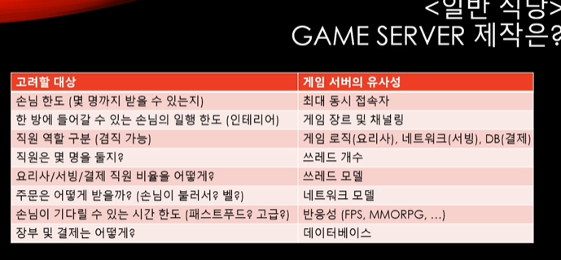

# Section 4-1 에디터 입문
***Date : 2023. 09. 20***

**Web Server **
(테이크아웃 포장 전문 식당)
손님이 음식을 받아서 떠나면, 이후론 연락이 끊긴다.
질의/응답 형태

드물게 정보를 요청/갱신한다
실시간 interaction이 필요치 않다.
식당에서 손님에게 먼저 접근할 일은 없다.

프레임워크를 하나 골라서 사용한다.
ASP.NET(C#)
Spring 등..

**Game Server **
(일반 식당)
직원이 와서 손님에게 물어볼 수 있고, 손님이 추가 주문을 하기도 한다.

요청/갱신 횟수가 많으며
실시간 interaction이 필요하다.
직원이 손님에게 자주 접근한다.
손님이 식당에 머무는 동안, 손님의 상태를 보며 최상의 서비스를 제공한다.

웹 서버와 다르게 최적의 프레임워크라는 것이 존재하기 애매하다. (게임 자을에 따라 요구사항이 너무나도 다르기 때문)

회전 초밥/ 국밥/ 삼겹살 집의 메뉴가 다른데 식당 인테리어와 직원이 같을 수 없기때문이다.

- 멀티쓰레드
- 네트워크
- 서버 구조 

에 대해 집중적으로 살펴볼 예정이다.

게임 서버와 웹 서버 개발에 대해 잘 알고 있어야 한다.