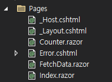
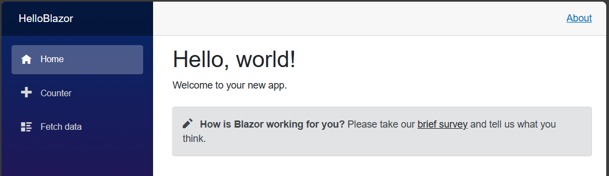

# Section 3.6 Hello Blazor Server
## Blazor Server

Blazor 관련 템플릿은 크게 [ 블레이저 서버 앱 ] 과 [ Blazor WebAssembly 앱 ] 으로 나누어져 있다. 각각 서버 측면과 클라이언트 측면의 템플릿이라고 봐도 괜찮다.

먼저 서버 설정 관련 코드가 작성되어 있는 Program.cs 파일에 확인해보면 다음과 같은 특징을 확인할 수 있다.

```csharp
var builder = WebApplication.CreateBuilder(args);

builder.Services.AddRazorPages();
builder.Services.AddServerSideBlazor();
builder.Services.AddSingleton<WeatherForecastService>();
```

Blazor 라는 이름의 템플릿을 사용하고는 있지만 Razor Pages 서버의 설정인 `AddRazorPages`를 사용하고 있다. 이는 블레이저도 Razor Pages 기능을 사용하기 때문이다. 

서버 사이드 블레이저임을 유추 할 수 있는 `AddServerSideBlazor` 서비스도 사용중이다.

마지막에 사용한 `AddSingleton<WeatherForecastService>`는 필수적인 설정이 아닌 특정 클래스를 블레이저 서버의 서비스 컨테이너에 싱글톤 패턴으로 등록하는 부분이다. 이렇게 등록된 서비스는 애플리케이션에서 공유되며 필요한 부분에 주입하여 사용할 수 있게 된다.

해당 클래스 정보는 프로젝트 `Data 폴더`에 구현되어 있으며, 이렇게 구현된 클래스를 앱 서비스 설정을 하는 `Program.cs` 에 구성해주는 방식을 사용하고 있는 것이다. 

진입점을 설정하는 라우팅 부분은 `app.MapFallbackToPage("/_Host")`를 사용하고 있다. **`_Host`**는 `Pages 폴더`에 보면 `.cshtml 확장자`로 존재하고 있는 것을 알 수 있다.


💡 **Program.cs 파일의 역할**

이전 버젼의 웹 서버 개발 템플릿들은 Program.cs 파일과 Startup.cs 파일로 애플리케이션 진입점 설정, 서비스 컨테이너 설정, 동작 및 구성을 결정하고 있었다. 현재는 모든 설정들이 Pregram.cs 파일에 통합되어 관리되고 있다.

지금까지 **`builder.Services`** 에 접근하여 어떤 방식으로 서버를 사용할 것인지를 정해주고 있었는데, 이 부분은 서버의 서비스 컨테이너에 해당 기능을 등록한다는 개념이다. **(정확히 말하자면 해당 기능의 의존성을 불어넣고 있는 것이다)**

크게 보면 서비스 컨테이너에 의존성을 등록하고 해당 의존성을 블레이저 컴포넌트나 페이지에 주입하여 사용함으로써 애플리케이션의 동작을 결정하고 제어할 수 있게 된다.

애플리케이션 **`진입점(endPoint)`** 설정을 해주는 부분도 해당 파일에서 계속 해주었으며, 서비스 컨테이너에 어떤 방식의 의존성을 주입했냐에 따라 진입점 설정 방식이 달라지고 있는 것이다.


### Pages 폴더 구성

Pages 폴더를 확인해보면 아래와 같이 `.cshtml 확장자`와 `.razor 확장자`를 가지는 파일들이 있는 것을 확인할 수 있다. 각각 `Razor 페이지`와 `Razor 컴포넌트(구성요소)`라고 불리고 있다.



진입점에 있는 `_Host.cshtml`도 있는 것을 확인할 수 있다. 버젼마다 차이가 있지만 아래와 같이 Layout를 또 다른 cshtml에 작성하여 바인딩해주고 있고 `component 태그`를 사용하여 `App`이라고 하는 `Razor 컴포넌트`를 바인딩해주고 있다. **(바인딩은 어떤 기능이나 데이터, 페이지 등을 연결하는 역할이라고 정리하면 된다)**

```html
@page "/"
@namespace HelloBlazor.Pages
@addTagHelper *, Microsoft.AspNetCore.Mvc.TagHelpers
@{
    Layout = "_Layout";
}

<component type="typeof(App)" render-mode="ServerPrerendered" />
```

다음은 App 컴포넌트가 어떤 모습인지를 확인해야 하는데 , `Found ~ NotFound 태그`를 사용하여 어떤 컨텍스트의 존재 여부에 따라 애플리케이션 흐름을 제어하고 있다. **(당장 구체적으로 무엇을 하는지에는 신경을 쓰지 말자)**

```html
<Router AppAssembly="@typeof(App).Assembly">
    <Found Context="routeData">
        <RouteView RouteData="@routeData" DefaultLayout="@typeof(MainLayout)" />
        <FocusOnNavigate RouteData="@routeData" Selector="h1" />
    </Found>
    <NotFound>
        <PageTitle>Not found</PageTitle>
        <LayoutView Layout="@typeof(MainLayout)">
            <p role="alert">Sorry, there's nothing at this address.</p>
        </LayoutView>
    </NotFound>
</Router>
```

`DefaultLayout` 에 지정되어있는 `MainLayout`은 `Shard 폴더` 내부에 존재한다.

```html
@inherits LayoutComponentBase

<PageTitle>HelloBlazor</PageTitle>

<div class="page">
    <div class="sidebar">
        <NavMenu />
    </div>

    <main>
        <div class="top-row px-4">
            <a href="https://docs.microsoft.com/aspnet/" target="_blank">About</a>
        </div>

        <article class="content px-4">
            @Body
        </article>
    </main>
</div>
```

코드를 분석해보면 홈페이지의 메인 UI에 대한 부분이다. sidebar 부분에 의해 UI의 왼쪽 메뉴들이 결정되었고 <mian> 태그로 감써져 있는 부분들에 의해 UI의 메인 부분이 결정되고 있다. 

`NavMenu` 는 또다른 `Razor 컴포넌트`이다. **이처럼 여러 컴포넌트들을 만들어놓고 사용하고자 하는 곳에서 해당 컴포넌트를 호출하여 사용하는 것이 블레이저 서버 템플릿의 기본적인 컨셉이다.**



태그들에 지정되어 있는 옵션(top-row px-4, context px-4 등)은 이미 구현되어 있는 라이브러리에 지정되어 있는 UI 설정이다. 해당 라이브러리는 `wwwroot 폴더`의 `css→bootstrap`에 저장되어 있다. `bootstrap`은 **UI 작업의 핵심적인 역할을 하는 라이브러리이며 굉장히 광범위한 기능을 제공하므로 따로 시간내어 공부할 필요성이 있다.**

`Razor 컴포넌트`를 보면 HTML 방식으로 작성되어 있는 부분과 C# 코드가 있는 부분이 구역을 나눠 함께 쓰여지고 있다. 즉, `Razor 페이지`와 같이 **뷰에 해당하는 부분과 컨트롤러가 함께 사용되고 있는 것**을 볼 수 있는데, 차이점은 Razor 페이지는 그래도 파일이 따로따로 구별되어 있지만 **Razor 컴포넌트는 하나의 파일에 두 영역으로 나누어져 사용되고 있다.**

```html
<div class="top-row ps-3 navbar navbar-dark">
    <div class="container-fluid">
        <a class="navbar-brand" href="">HelloBlazor</a>
        <button title="Navigation menu" class="navbar-toggler" @onclick="ToggleNavMenu">
            <span class="navbar-toggler-icon"></span>
        </button>
    </div>
</div>

@code {
    private bool collapseNavMenu = true;

    private string? NavMenuCssClass => collapseNavMenu ? "collapse" : null;

    private void ToggleNavMenu()
    {
        collapseNavMenu = !collapseNavMenu;
    }
}
```

`NavMenu 컴포넌트`를 보면 사이드 바를 구성하는 버튼들의 설정을 볼 수 있다.

```html
<div class="@NavMenuCssClass" @onclick="ToggleNavMenu">
    <nav class="flex-column">
        <div class="nav-item px-3">
            <NavLink class="nav-link" href="" Match="NavLinkMatch.All">
                <span class="oi oi-home" aria-hidden="true"></span> Home
            </NavLink>
        </div>
        <div class="nav-item px-3">
            <NavLink class="nav-link" href="counter">
                <span class="oi oi-plus" aria-hidden="true"></span> Counter
            </NavLink>
        </div>
        <div class="nav-item px-3">
            <NavLink class="nav-link" href="fetchdata">
                <span class="oi oi-list-rich" aria-hidden="true"></span> Fetch data
            </NavLink>
        </div>
    </nav>
</div>
```

NavLink 태그를 사용하여 클릭시 어느 컴포넌트가 동작되는지를 지정하고 있는다. (href="counter" )

이처럼 사용할 수 있는 이유는 **각 컴포넌트별로 @page 키워드를 사용하여 자신의 위치를 라우팅해주고 있기 때문이다.**

아래는 Counter.razor의 페이지 라우팅 코드이다.

```html
@page "/counter"

<PageTitle>Counter</PageTitle>

<h1>Counter</h1>

<p role="status">Current count: @currentCount</p>

<button class="btn btn-primary" @onclick="IncrementCount">Click me</button>

@code {
    private int currentCount = 0;

    private void IncrementCount()
    {
        currentCount++;
    }
}
```

`@code 키워드`를 통해 컨트롤러 부분을 작성해주고 있는데 뷰 부분에서 바인딩 되는 값들을 바로 확인할 수 있어 편리하다.

`button 태그`의 `onclick 옵션`은 코드 부분의 메소드와 연결되어 사용된다. 직접 람다 함수를 작성하여 사용할 수도 있다. **(인자가 있는 메소드는 사용할 수 없으므로 인자를 이용하기 위해서는 람다 함수를 사용해야한다)**

FetchData 컴포넌트는 아래와 같이 구성되어 있다.

```html
@page "/fetchdata"

<PageTitle>Weather forecast</PageTitle>

@using HelloBlazor.Data
@inject WeatherForecastService ForecastService

@if (forecasts == null)
{
    <p><em>Loading...</em></p>
}
else
{
    <table class="table">
        <thead>
            <tr>
                <th>Date</th>
                <th>Temp. (C)</th>
                <th>Temp. (F)</th>
                <th>Summary</th>
            </tr>
        </thead>
        <tbody>
            @foreach (var forecast in forecasts)
            {
                <tr>
                    <td>@forecast.Date.ToShortDateString()</td>
                    <td>@forecast.TemperatureC</td>
                    <td>@forecast.TemperatureF</td>
                    <td>@forecast.Summary</td>
                </tr>
            }
        </tbody>
    </table>
}

@code {
    private WeatherForecast[]? forecasts;

    protected override async Task OnInitializedAsync()
    {
        forecasts = await ForecastService.GetForecastAsync(DateTime.Now);
    }
}
```

특이한 점은 `@inject WeatherForecastService ForecastService` 이 있다. 이 부분은 서비스 컨테이너에서 설정한 의존성을 해당 페이지에 주입하여 사용하고 있는 것이다. **(해당 페이지에 클래스를 인스턴스화하여 사용하고 있는 것과 같다. 하지만 해당 클래스는 싱글톤 방식이므로 실제 개별 인스턴스가 생성되는 것은 아니다)**

또한 실제 C# 코드도 뷰 부분에서 사용하고 있음을 볼 수 있다. 

```html
@foreach (var forecast in forecasts)
{
    <tr>
        <td>@forecast.Date.ToShortDateString()</td>
        <td>@forecast.TemperatureC</td>
        <td>@forecast.TemperatureF</td>
        <td>@forecast.Summary</td>
    </tr>
}
```

특히 foreach 문법을 이용하여 배열의 크기에 따라 UI의 테이블의 행을 동적으로 관리되고 있다.