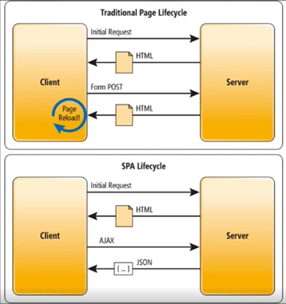

# Section 3.7 Hello Blazor Client + SPA
## Blazor Client

기본적으로 웹 브라우저에서 실행되는 웹 애플리케이션이지만 기존의 방식과 약간의 차이점이 존재하는 방식이다. `Blazor WebAssembly 애플리케이션`은 초기 로드 시 서버로부터 필요한 `C# 및 .NET 어셈블리를 받아 클라이언트 측에서 실행하는 방식`으로 동작한다.

템플릿의 구조를 확인해보면 서비스 컨테이너를 등록하고 라우팅을 하던 `Program.cs` 파일이 `Client 폴더`에 위치하게 변경되었으며 파일의 내용에서 라우팅을 하는 부분이 사라졌음을 볼 수 있다.

### Single Page Application (SPA)

전체 새로운 페이지를 서버로부터 불러오는 대신 현재 페이지를 동적으로 다시 작성하여 웹 애플리케이션 방식이다. 기존의 다중 페이지 웹 애플리케이션에서는 링크를 클릭하거나 양식을 제출할 때 일반적으로 **전체 페이지를 로드하게 되지만**, SPA에서는 **필요한 컨텐츠만 업데이트**한다. 이 과정에서 로드가 필요한 데이터는 `AJAX(Asynchronous Javascript And XML) 요청`을 통해 JSON 형태 등의 빠른 통신이 가능한 데이터를 받아 클라이언트 측에서 업데이트를 진행한다. 

SPA 방식으로 웹을 구성하는 것은 자바 스크립트로만 가능했다. 이는 브라우저 자체가 자바 스크립트로 대부분 설계되어 있었기 때문인데, 그로 인해 서버 개발을 다른 언어로 하더라도 클라이언트 측은 자바 스크립트에 의존해야 SPA 구현이 가능했다.

Blazor가 등장하면서 C#으로도 SPA 방식으로 개발이 가능했다. 이는 자바 스크립트가 내부적으로 `DOM(Document Object Model)`으로 데이터들을 변환하여 페이지를 업데이트하는 방식을 요청하는 것을 가능해져서 그렇다. Blazor는 `Signal-R`이라는 방식으로 자바 스크립트의 **DOM 변환 기능을 호출할 수 있다.**

SPA는 클릭할 떄마다 새로운 페이지가 생성되는게 시간을 대폭 줄일 수 있어서 속도가 제한적인 상황에서나 빠른 반응속도가 필요할 때 유용하게 사용된다.