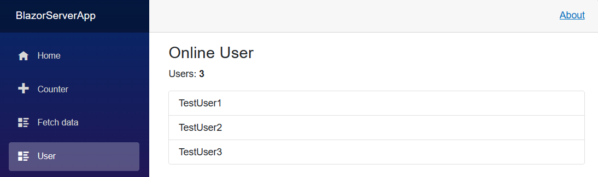
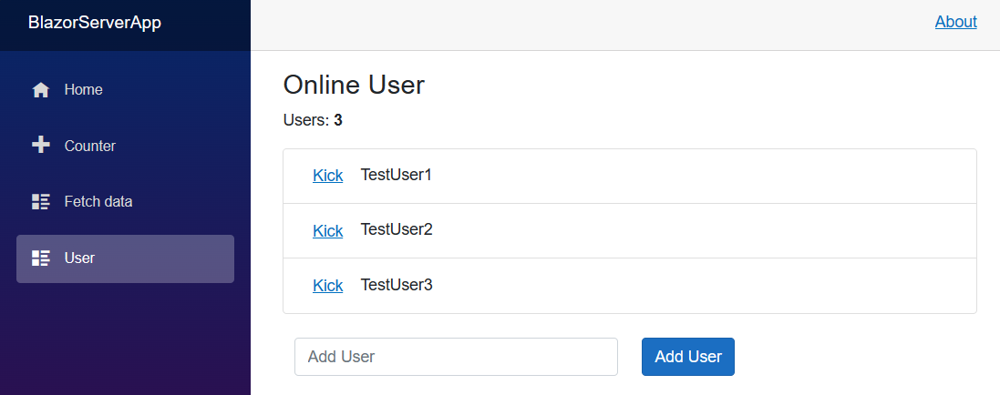

# Section 4.2 Binding 실습
바인딩을 제대로 익히면 여러가지 기능을 구현하는데 도움이 된다. 

실습을 위해 새로운 Razor 컴포넌트를 생성하여 페이지 라우팅을 정해주고 Data쪽에도 클래스를 생성하여 데이터를 저장할 클래스를 작성해준다. 

```html
<-- User.razor 파일 -->

@page "/user"
@using BlazorServerApp.Data

<h3>User</h3>

@code {
	List<UserData> _users = new List<UserData>();
}
```

C# 클래스를 작성해줄때는 자동으로 namespace를 지정해주기 때문에 각 파일을 연결시켜주는 작업을 하지 않아도 문제가 없었지만 Razor 컴포넌트를 사용할 때는 @using 키워드를 사용하여 namespace를 바인딩 시켜줘야 한다.

```csharp
# UserData.cs 파일

namespace BlazorServerApp.Data
{
    public class UserData
    {
        String _userName;
    }
}
```

`protected override void OnInitialized()`를 이용하여 페이지가 열렸을 때 동작하여 초기화를 해주는 부분을 구현할 수 있다. 해당 함수는 이미 구현되어 있으므로 `override`를 시켜줘야 한다.

```csharp
@page "/user"
@using BlazorServerApp.Data

<h3>User</h3>

@code {
	List<UserData> _users = new List<UserData>();

	protected override void OnInitialized()
	{
		_users.Add(new UserData() { _userName = "TestUser1" });
		_users.Add(new UserData() { _userName = "TestUser2" });
		_users.Add(new UserData() { _userName = "TestUser3" });
	}
}
```

_users 리스트의 값을 UI로 표현하기 위해 뷰 부분에 HTML 코드를 추가한다.

```html
<h3>Online User</h3>

<p>
	Users: <b>@_users.Count()</b>
</p>

<ul class="list-group">
	@foreach (UserData user in _users)
	{
		<li @key="user" class ="list-group-item">
			<label>@user._userName</label>
		</li>
	}
</ul>
```

리스트의 크기에 따라 UI로 나타내줄 목록의 개수도 달라져야 하므로 @foreach로 C# 반복문을 활용해준다.

`<li @key="user" class ="list-group-item">` 부분에서 `@key`는 해당 리스트의 항목이 반복문이 진행되면서 변경되는 `user 요소`와 연결되어 있음을 명시해주고 있는 것이다. 이를 통해 컴파일러가 해당 리스트의 변화를 더 확실하게 감지할 수 있게 된다. (사용하지 않아도 결과는 다르지 않다)



리스트에 유저를 추가하는 기능을 구현하기 위해 아래와 같이 UI를 구성해준다.

```html
<div class = "container">
	<div class = "row">
		<div class="col">
			<input class="form-control" placeholder="Add User" @bind-value="_inputName"/>
		</div>
		<div class ="col">
			<button class = "btn btn-primary" type="button" @onclick="AddUser">Add User</button>
		</div>
	</div>
</div>
```

여러개의 div 태그를 사용한 이유는 UI 상의 위치를 조절하기 위함이다. 이는 HTML 작성요령이다.

`input 태그`의 `@bind_value`에는 UI상 입력한 문자열을 저장할 변수를 입력해준다. **(이전 강의에서 배운 뷰→컨트롤러 방향의 바인딩 방식이다)**

`button 태그`의 `@onclick` 에 저장한 `AddUser`는 컨트롤러에 작성한 함수를 지정해줘야 한다. 버튼을 클릭할 경우 `input태그`에서 저장한 값이 실제 리스트에 추가되는 동작을 구현해야 한다.

```csharp
code {
	List<UserData> _users = new List<UserData>();
	string _inputName = "";
	protected override void OnInitialized()
	{
		_users.Add(new UserData() { _userName = "TestUser1" });
		_users.Add(new UserData() { _userName = "TestUser2" });
		_users.Add(new UserData() { _userName = "TestUser3" });
	}

	void AddUser()
	{
		_users.Add(new UserData() { _userName = _inputName });
		_inputName = "";
	}
}
```

리스트 값에 대한 선택삭제 기능을 구현하기 위해 리스트 항목옆에 버튼 태그를 사용하여 버튼을 만든다.

```html
@foreach (UserData user in _users)
	{
		<li @key="user" class ="list-group-item">
			<button type="button" class="btn btn-link" @onclick="(() => KickUser(user))">Kick</button>
			<label>@user._userName</label>
		</li>
	}
```

```csharp
void KickUser(UserData user)
{
		_users.Remove(user);
}
```

각 유저 이름에 매칭된 버튼이므로 해당 버튼을 클릭하게 되면 어떤 유저를 삭제해야할지 함수의 매개변수로 알려줄 필요가 생긴다. 그렇지만 `@onclick`으로 바인딩하는 함수는 기본적으로 **인자를 받지 못하므로 람다 함수 방식을 사용하여 인자를 간접적으로 전달하는 방식을 사용한다.**



컨트롤러 부분의 데이터에 바인딩을 해주게 되면 실제 컨트롤러 데이터 값이 변경되면 실제로도 반영된다. **(경우에 따라 수동으로 갱신을 해줘야하는 부분도 생기기도 하는데, 곧 알아본다)**

**이러한 작업을 데이터베이스와 연동하여 작업되는 것이 실제 웹에서 사용되는 방식이다.**